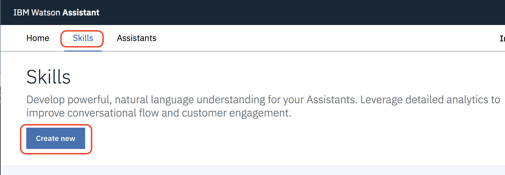
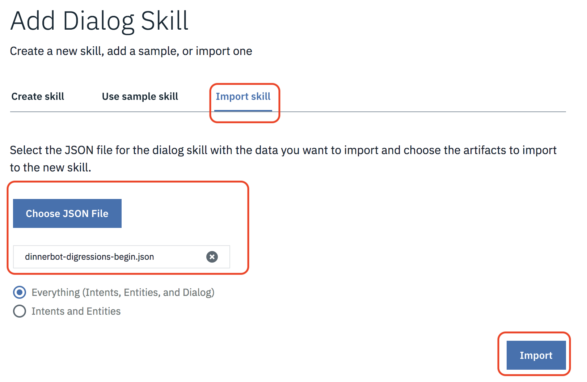
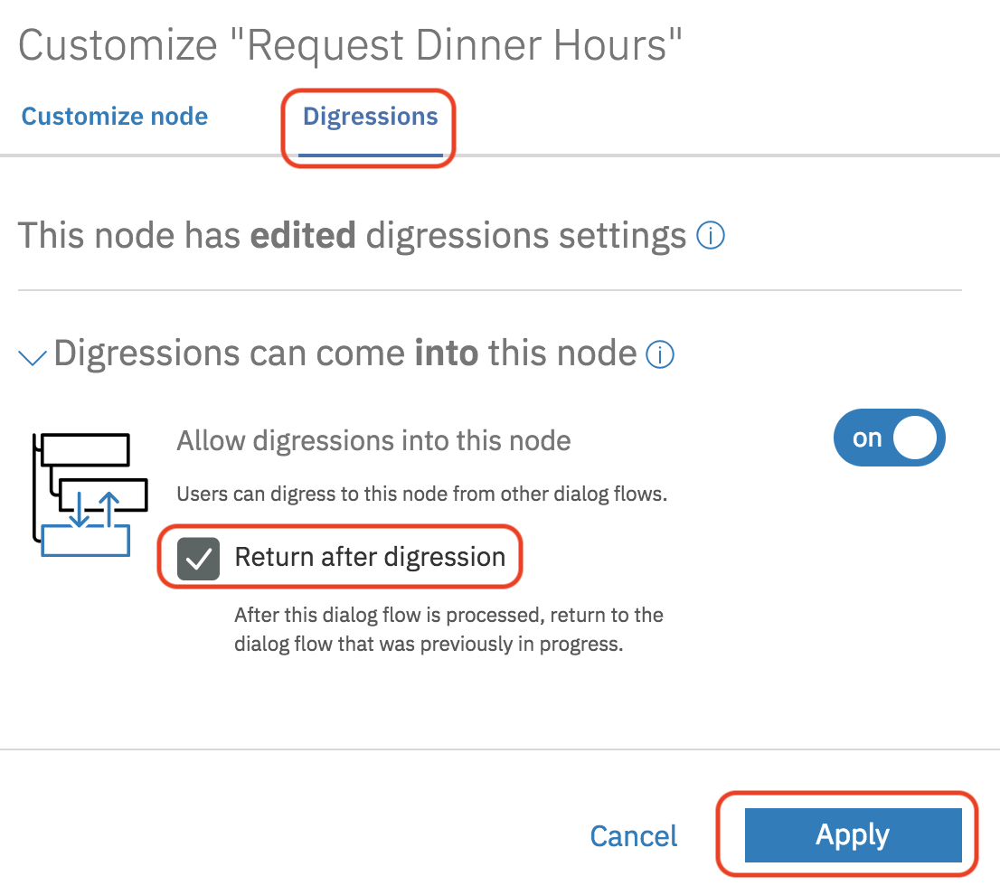
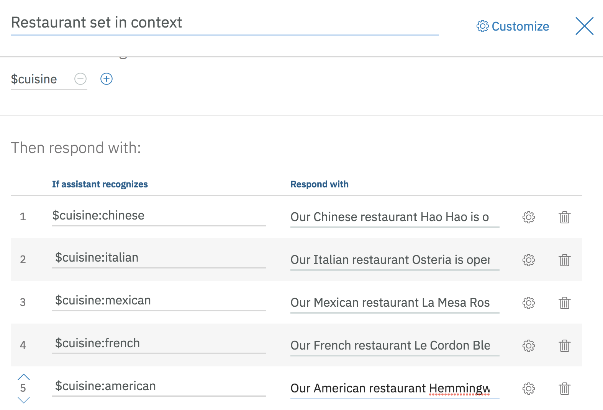
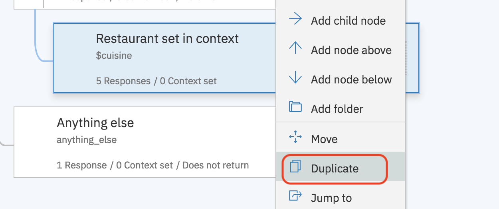
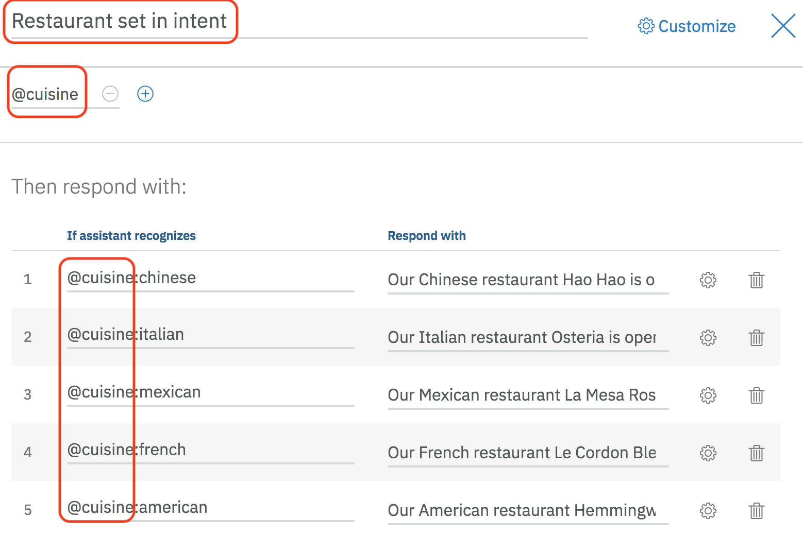
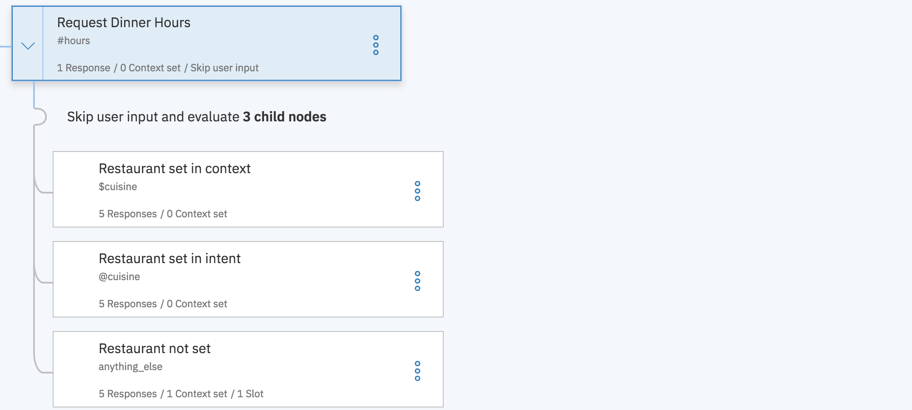
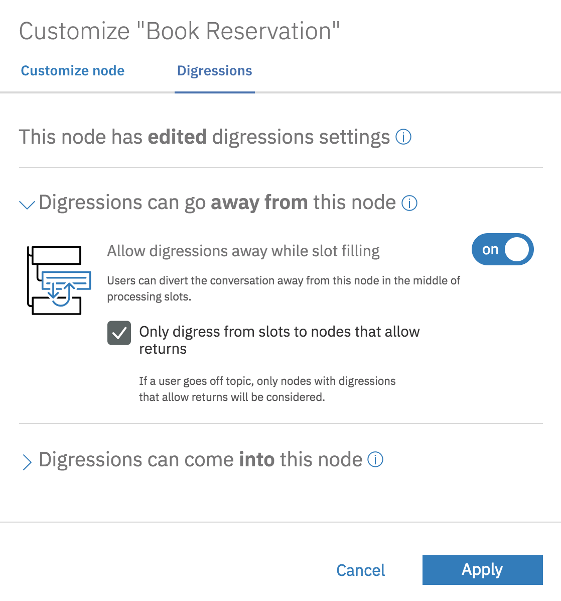
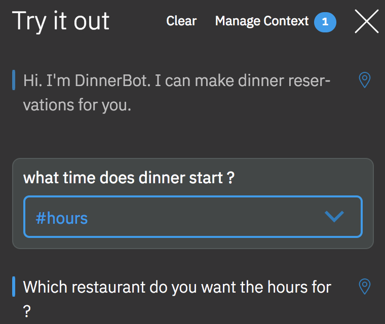
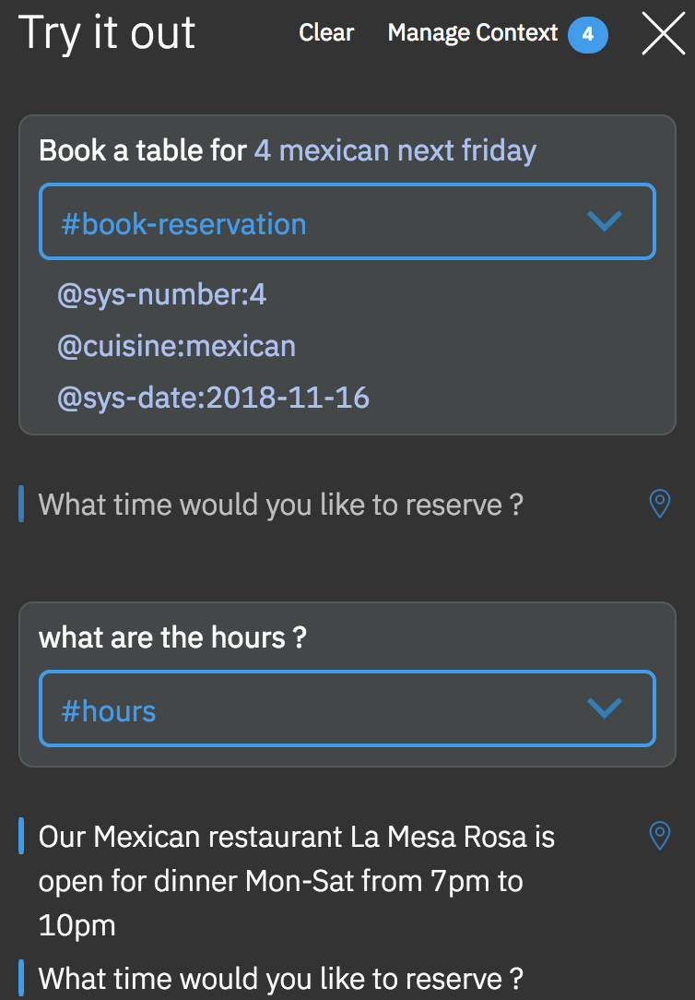

# Introduction to Watson Assistant

## Lab 3 - Using digressions

## Overview

This is a continuation of the lab exercise [Using slots and server functions](https://github.com/djccarew/watson-assistant-slots-cloud_functions) that introduces a new important feature of Watson Assistant.

**Digressions** - A digression occurs when a user is in the middle of a dialog flow that is designed to address one goal, and abruptly switches topics to initiate a dialog flow that is designed to address a different goal. With digression settings, you can allow the conversation to return to the dialog flow that was interrupted when the digression occurred. For example, the user might be ordering a new phone, but switches topics to ask about tablets. Your dialog can answer the question about tablets, and then bring the user back to where they left off in the process of ordering a phone. Allowing digressions to occur and return gives your users more control over the flow of the conversation at run time. They can change topics, follow a dialog flow about the unrelated topic to its end, and then return to where they were before.

in this lab you'll add a Digression to DinnerBot to allow the users to return restaurant hours wherever they are in the conversation flow.

## Part 1 Adding digressions to DinnerBot

### Step 1: Import the starting skill

If not open already, navigate to the [Bluemix Console](https://console.bluemix.net/) and launch your IBM Watson Assistant service.

To save time you'll import a skill as a starting point that has all the DinnerBot intents and entities  already defined.

1. Download the saved skills file [dinnerbot-digressions-begin.json](skills/dinnerbot-digressions-begin.json) to your local filesystem. (Click "Raw" from the link above to get the raw format to save locally)

2. From the Watson Assistant tooling click on the **Skills** tab and click on **Create new**

3. Click on **Import skill**, click **Choose JSON file**, select the file ***dinnerbot-digressions-begin.json*** and then click **Import**

4. The imported skill will open up in the tool. Click on the  **Intents** tab and note that we've added an intent to request dinner hours for the restaurants. Take a look at the example for the *#hours* intent to see the examples that were used.

### Step 2: Add the restaurant hours dialog nodes

1. Go to the **Dialog**, select the **Book Reservation** node and click **Add node**

2. Name the node *Request Dinner Hours* and select the **#hours** intent where it says **if assistant recognizes**

3. Click on **Customize** in the top right corner. Select **Digressions**, expand **Digressions can come into this node**, enable it, and then select **Return after digression** Click **Apply**

4. Select the node **Request Dinner Hours** and click **Add child node**. Name the node *Restaurant set in context* and enter the context variable **$cuisine** where it says **If assistant recognizes**

5. Click on **Customize** in the top right corner and enable **Multiple responses**. Click **Apply**

6. Add the following values to the area labelled **Then respond with** clicking on **Add response** after each entry

| If assistant recognizes       | Respond with                                                                       |
|-------------------------------|------------------------------------------------------------------------------------|
| $cuisine:chinese              | Our Chinese restaurant Hao Hao is open for dinner everyday from 6pm to 10pm        |
| $cuisine:italian              | Our Italian restaurant Osteria is open for dinner Mon-Sat from 6pm to 10pm         |
| $cuisine:mexican              | Our Mexican restaurant La Mesa Rosa is open for dinner Mon-Sat from 7pm to 10pm    |
| $cuisine:french               | Our French restaurant Le Cordon Bleu is open for dinner Mon-Sat from 7pm to 10pm   |
| $cuisine:american             | Our American restaurant Hemmingway's is open for dinner everyday from 7pm to 10pm  |

7. Select the new node **Restaurant set in context**, click on the 3 dots on the right, and then select **Duplicate** from the context menu

8. Change the name of the new node to *Restaurant set in intent* and enter the entity **@cuisine** where it says **If assistant recognizes**

9. In the section labelled **Then respond with:** change the values under **If assistant recognizes** to use the entity **@cuisine** instead of the context variable **$cuisine** as shown below (note: the responses don't need to be changed)

10. Duplicate the node you just modified and name it *Restaurant not set*. Enter **anything_else** where it says **If assistant recognizes**.

11. Click on **Customize** in the top right corner. Enable slots and  select **Prompt for everything**. Click **Apply**

12. Add the following values to the area labelled **Then check for** for a single entry.

| Check for   | Save it as  | If not present, ask                         |
|-------------|-------------|---------------------------------------------|
| @cuisine    | $hours_for  | Which restaurant do you want the hours for? |

13. Select the node **Request Dinner Hours**. Go to the section **And finally** and select **Skip user input**.

14. Select the node **Book Reservation**. Click on **Customize** in the top right corner. Select **Digressions**, expand **Digressions can go away from  this node**, enable it  and select **Only digress from slots to nodes that allow returns** Click **Apply**

### Step 3: Test your chatbot

The Watson Assistant tooling offers a testing panel to test phrases to confirm the correct intents, entities, and dialog are matched and returned.

1. To test the bot, click on the **Try it** icon in the top-right corner of the tooling.

2. A side panel appears and shows the contents of the node that matches welcome. Enter a message that triggers the #hours intent. Start with  `what time does dinner start ?`

3. Verify that you're prompted for a restaurant.

4. Enter `Hao Hao` or `chinese` and verify that the hours for the chinese restaurant are returned.

5. Click on the **Clear** link to start over with the test tool.  Type `When is dinner at the chinese restaurant` when prompted.

6. Verify that the hours for Hao Hao are returned

7. Now you'll test a digression. Click on the **Clear** link to start over with the test tool.  Type `Book a table for 4 mexican next friday ` when prompted.

8. Verify that you are prompted for the time. Instead of the time enter `what are the hours` instead

9. Verify that the hours of the  Mexican restaurant are returned and you're prompted for the time of your reservation again.

## Summary

Pat yourself on the back. You've seen how digressions can be used to seamlessly handle certain types of user input at any point in the dialog flow.
